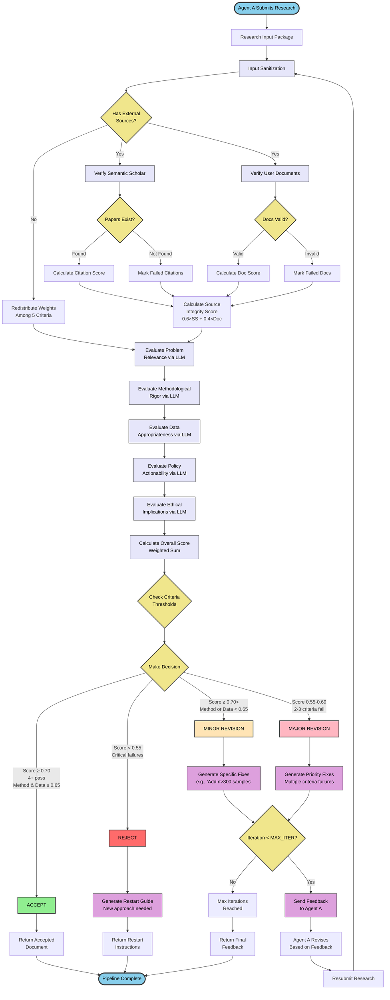

```mermaid
graph TB
    Start([Agent A Submits Research]) --> Input[Research Input Package]
    
    Input --> Sanitize[Input Sanitization]
    
    Sanitize --> CheckSources{Has External<br/>Sources?}
    
    CheckSources -->|Yes| VerifySS[Verify Semantic Scholar]
    CheckSources -->|Yes| VerifyDocs[Verify User Documents]
    CheckSources -->|No| NoSourceWeight[Redistribute Weights<br/>Among 5 Criteria]
    
    VerifySS --> SSCheck{Papers Exist?}
    SSCheck -->|Found| SSScore[Calculate Citation Score]
    SSCheck -->|Not Found| SSFail[Mark Failed Citations]
    
    VerifyDocs --> DocCheck{Docs Valid?}
    DocCheck -->|Valid| DocScore[Calculate Doc Score]
    DocCheck -->|Invalid| DocFail[Mark Failed Docs]
    
    SSScore --> SourceIntegrity[Calculate Source<br/>Integrity Score<br/>0.6×SS + 0.4×Doc]
    SSFail --> SourceIntegrity
    DocScore --> SourceIntegrity
    DocFail --> SourceIntegrity
    
    NoSourceWeight --> Evaluate1[Evaluate Problem<br/>Relevance via LLM]
    SourceIntegrity --> Evaluate1
    
    Evaluate1 --> Evaluate2[Evaluate Methodological<br/>Rigor via LLM]
    Evaluate2 --> Evaluate3[Evaluate Data<br/>Appropriateness via LLM]
    Evaluate3 --> Evaluate4[Evaluate Policy<br/>Actionability via LLM]
    Evaluate4 --> Evaluate5[Evaluate Ethical<br/>Implications via LLM]
    
    Evaluate5 --> CalcScore[Calculate Overall Score<br/>Weighted Sum]
    
    CalcScore --> CheckThresholds{Check Criteria<br/>Thresholds}
    
    CheckThresholds --> Decision{Make Decision}
    
    Decision -->|Score ≥ 0.70<br/>4+ pass<br/>Method & Data ≥ 0.65| Accept[ACCEPT]
    Decision -->|Score ≥ 0.70<<br/>Method or Data < 0.65| MinorRev[MINOR REVISION]
    Decision -->|Score 0.55-0.69<br/>2-3 criteria fail| MajorRev[MAJOR REVISION]
    Decision -->|Score < 0.55<br/>Critical failures| Reject[REJECT]
    
    Accept --> ReturnDoc[Return Accepted<br/>Document]
    ReturnDoc --> End([Pipeline Complete])
    
    MinorRev --> GenMinorFeedback[Generate Specific Fixes<br/>e.g., 'Add n>300 samples']
    MajorRev --> GenMajorFeedback[Generate Priority Fixes<br/>Multiple criteria failures]
    Reject --> GenRejectFeedback[Generate Restart Guide<br/>New approach needed]
    
    GenMinorFeedback --> CheckIter{Iteration < MAX_ITER?}
    GenMajorFeedback --> CheckIter
    
    CheckIter -->|Yes| SendFeedback[Send Feedback<br/>to Agent A]
    CheckIter -->|No| MaxIter[Max Iterations<br/>Reached]
    
    SendFeedback --> AgentRevise[Agent A Revises<br/>Based on Feedback]
    AgentRevise --> Resubmit[Resubmit Research]
    Resubmit --> Sanitize
    
    GenRejectFeedback --> RestartGuide[Return Restart<br/>Instructions]
    RestartGuide --> End
    MaxIter --> ReturnFinal[Return Final<br/>Feedback]
    ReturnFinal --> End
    
    style Accept fill:#90EE90,stroke:#333,stroke-width:2px,color:#000
    style MinorRev fill:#FFE4B5,stroke:#333,stroke-width:2px,color:#000
    style MajorRev fill:#FFB6C1,stroke:#333,stroke-width:2px,color:#000
    style Reject fill:#FF6B6B,stroke:#333,stroke-width:2px,color:#000
    style Start fill:#87CEEB,stroke:#333,stroke-width:3px,color:#000
    style End fill:#87CEEB,stroke:#333,stroke-width:3px,color:#000
    
    classDef process fill:#E6E6FA,stroke:#333,stroke-width:1px,color:#000
    classDef decision fill:#F0E68C,stroke:#333,stroke-width:2px,color:#000
    classDef feedback fill:#DDA0DD,stroke:#333,stroke-width:1px,color:#000
    
    class Sanitize,VerifySS,VerifyDocs,Evaluate1,Evaluate2,Evaluate3,Evaluate4,Evaluate5,CalcScore process
    class CheckSources,SSCheck,DocCheck,CheckThresholds,Decision,CheckIter decision
    class GenMinorFeedback,GenMajorFeedback,GenRejectFeedback,SendFeedback feedback
```
